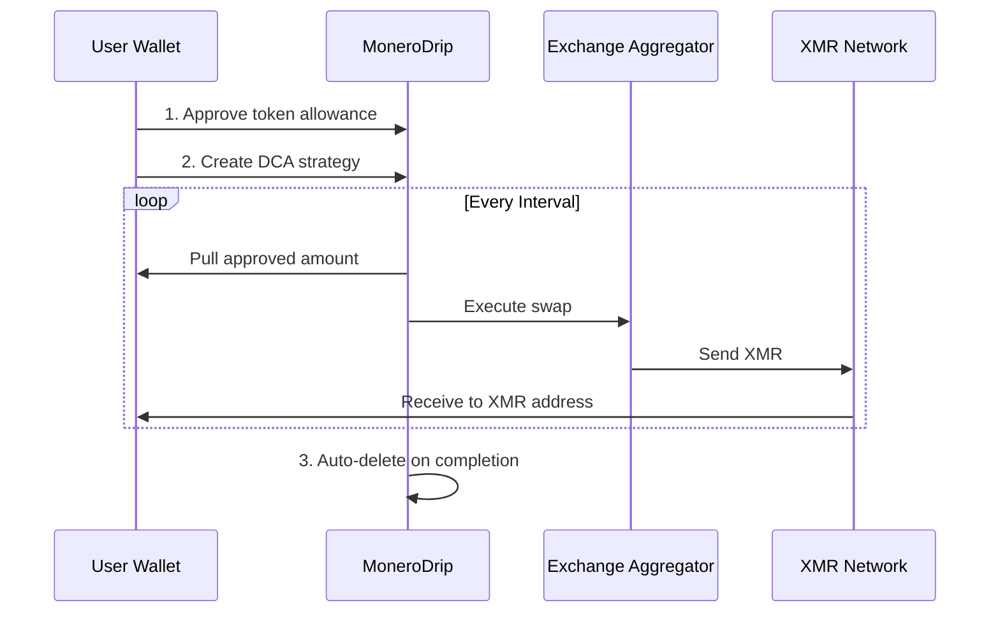

<p align="center">
  
  
  
  
  
</p>

<h1 align="center">
  💧 MoneroDrip
</h1>

<p align="center">
  <strong>Privacy-First Automated DCA into Monero (XMR)</strong>
</p>

<p align="center">
  <em>No accounts. No cookies. No analytics. Just private, automated investing.</em>
</p>

<p align="center">
  <a href="#-features">Features</a> •
  <a href="#-how-it-works">How It Works</a> •
  <a href="#-monero-technology">Monero Tech</a> •
  <a href="#-getting-started">Getting Started</a> •
  <a href="#-architecture">Architecture</a> •
  <a href="#-roadmap">Roadmap</a>
</p>

---

## 🎯 Overview

**MoneroDrip** is a privacy-preserving Dollar-Cost Averaging (DCA) platform that enables automated, recurring purchases of Monero (XMR). Built with a philosophy of minimal data retention and maximum user privacy, MoneroDrip allows you to build your XMR position without exposing your identity or investment patterns.

```
┌─────────────────────────────────────────────────────────────────┐
│                                                                 │
│   💰 Your Wallet  ──►  🔄 MoneroDrip  ──►  🔒 Your XMR Address  │
│                                                                 │
│   ✓ No KYC          ✓ No Tracking      ✓ Auto-Delete Logs      │
│                                                                 │
└─────────────────────────────────────────────────────────────────┘
```

---

## ✨ Features

### 🔐 Privacy by Design
- **No Account Required** - Connect your wallet and start immediately
- **No Cookies** - Zero browser tracking or fingerprinting
- **No Analytics** - We don't collect usage metrics
- **Auto-Delete** - Strategies are purged after completion or 3 failures

### 💼 Multi-Wallet Support
| Wallet | Networks | Status |
|--------|----------|--------|
| MetaMask | Ethereum, BSC, Polygon, Arbitrum | ✅ Supported |
| Phantom | Solana, Ethereum, Polygon | ✅ Supported |

### 📊 Flexible DCA Configuration
- **Multiple Assets** - USDC, USDT, WETH, WBTC, DAI
- **Custom Intervals** - Hourly, Daily, Weekly, Monthly, Yearly
- **Adjustable Orders** - Set your total number of executions
- **Real-time Validation** - XMR address verification

### 📈 Dashboard & Monitoring
- Active strategy overview with progress tracking
- Execution history with transaction details
- Pause, resume, or cancel anytime
- Last execution ID for verification

---

## 🔄 How It Works



### Step 1: Approve Allowance
Connect your wallet (MetaMask or Phantom) and approve a capped token allowance. You control exactly how much the contract can access.

### Step 2: Cron Executes
Our minimal backend checks due times and executes swaps through aggregators. Only the approved amount is pulled per execution.

### Step 3: Auto-Delete
When your strategy completes, you request deletion, or after 3 consecutive failures, all data is purged. Only the last execution ID is retained for verification.

---

## 🔒 Monero Technology

MoneroDrip leverages Monero's industry-leading privacy technology to ensure your investments remain confidential.

### Ring Signatures
```
┌─────────────────────────────────────────────────────────┐
│                    RING SIGNATURE                       │
│                                                         │
│   Actual Sender: ?                                      │
│                                                         │
│   ┌───┐  ┌───┐  ┌───┐  ┌───┐  ┌───┐  ┌───┐            │
│   │ A │  │ B │  │ C │  │ D │  │ E │  │...│  (16 keys) │
│   └───┘  └───┘  └───┘  └───┘  └───┘  └───┘            │
│                                                         │
│   → Cryptographically impossible to identify sender     │
└─────────────────────────────────────────────────────────┘
```
- Mixes your transaction with 15 decoy outputs
- Uses MLSAG (Multilayer Linkable Spontaneous Anonymous Group) signatures
- Key images prevent double-spending without revealing the sender

### Stealth Addresses
```
Public Address: 4AdUndXHHZ...
                    ↓
            ┌───────────────┐
            │ One-Time Key  │ ← Unique per transaction
            │   Generation  │
            └───────────────┘
                    ↓
Stealth Address: 7BnErVRQL3... (unlinkable to public address)
```
- Each transaction creates a unique one-time address
- Only the recipient can detect and spend funds
- Supports view-only wallets for auditing

### RingCT (Ring Confidential Transactions)
```
Transaction Amount: [HIDDEN]

Pedersen Commitment: C = yG + bH
├── b = hidden amount
├── G, H = elliptic curve generators
└── y = random blinding factor

Verification: Σ inputs = Σ outputs + fees ✓
```
- Hides transaction amounts using Pedersen Commitments
- Mathematically verifiable without revealing values
- Homomorphic properties enable balance verification

### Bulletproofs / Bulletproofs+
- Zero-knowledge range proofs without trusted setup
- 80%+ reduction in transaction size vs. previous methods
- Logarithmic proof scaling for efficiency
- Audited by QuarksLab and Kudelski Security

---

## 🚀 Getting Started

### Prerequisites

```bash
node >= 18.0.0
npm >= 9.0.0
```

### Installation

```bash
# Clone the repository
git clone https://github.com/Demerzels-lab/MoneroDrip.git

# Navigate to project directory
cd MoneroDrip

# Install dependencies
npm install

# Set up environment variables
cp .env.example .env
# Edit .env with your Supabase credentials

# Start development server
npm run dev
```

### Environment Variables

```env
# Supabase Configuration
VITE_SUPABASE_URL=your_supabase_url
VITE_SUPABASE_ANON_KEY=your_supabase_anon_key

# Optional: Exchange Aggregator API
VITE_AGGREGATOR_API_URL=https://api.aggregator.example
```

### Build for Production

```bash
# Build optimized bundle
npm run build

# Preview production build
npm run preview
```

---

## 🏗 Architecture

```
MoneroDrip/
├── src/
│   ├── components/          # Reusable UI components
│   │   ├── ui/              # Base components (Button, Card, Input)
│   │   ├── layout/          # Header, Footer, Navigation
│   │   └── features/        # Feature-specific components
│   ├── pages/               # Route pages
│   │   ├── Landing.tsx      # Home page with all sections
│   │   ├── Create.tsx       # Strategy creation wizard
│   │   ├── Dashboard.tsx    # User dashboard
│   │   ├── Docs.tsx         # Documentation
│   │   ├── Privacy.tsx      # Privacy policy
│   │   └── Terms.tsx        # Terms of service
│   ├── lib/                 # Utilities and configurations
│   │   ├── supabase.ts      # Supabase client
│   │   └── utils.ts         # Helper functions
│   ├── hooks/               # Custom React hooks
│   ├── types/               # TypeScript definitions
│   └── styles/              # Global styles
├── supabase/
│   ├── types.ts             # Generated database types
│   └── migrations/          # Database migrations
├── docs/                    # Design documentation
│   ├── content-structure-plan.md
│   ├── design-specification.md
│   └── design-tokens.json
└── public/                  # Static assets
```

### Database Schema

```sql
-- DCA Strategies
CREATE TABLE dca_strategies (
    id UUID PRIMARY KEY DEFAULT gen_random_uuid(),
    wallet_address TEXT NOT NULL,
    xmr_address TEXT NOT NULL,
    source_asset TEXT NOT NULL,
    amount_per_order DECIMAL(18,8) NOT NULL,
    interval_value INTEGER NOT NULL,
    interval_unit TEXT NOT NULL,
    total_orders INTEGER NOT NULL,
    completed_orders INTEGER DEFAULT 0,
    status TEXT DEFAULT 'active',
    last_execution_id TEXT,
    created_at TIMESTAMPTZ DEFAULT NOW(),
    next_execution_at TIMESTAMPTZ,
    failure_count INTEGER DEFAULT 0
);

-- Execution Logs
CREATE TABLE dca_executions (
    id UUID PRIMARY KEY DEFAULT gen_random_uuid(),
    strategy_id UUID NOT NULL,
    execution_id TEXT NOT NULL,
    status TEXT NOT NULL,
    amount_in DECIMAL(18,8),
    amount_out DECIMAL(18,8),
    tx_hash TEXT,
    error_message TEXT,
    executed_at TIMESTAMPTZ DEFAULT NOW()
);

-- Supported Assets
CREATE TABLE supported_assets (
    id SERIAL PRIMARY KEY,
    symbol TEXT NOT NULL UNIQUE,
    name TEXT NOT NULL,
    network TEXT NOT NULL,
    contract_address TEXT,
    min_amount DECIMAL(18,8) NOT NULL,
    is_active BOOLEAN DEFAULT true
);
```

---

## 🗺 Roadmap

### 2026 Development Plan

```
Q1 2026                    Q2 2026                    Q3 2026                    Q4 2026
────────────────────────   ────────────────────────   ────────────────────────   ────────────────────────
│                          │                          │                          │
├─ Multi-chain Support     ├─ Hardware Wallet         ├─ Fiat On-ramp           ├─ DAO Governance
│  • BSC Integration       │  • Ledger Support        │  • Privacy-preserving    │  • Token Launch
│  • Polygon Integration   │  • Trezor Support        │  • Multiple currencies   │  • Community Voting
│  • Arbitrum Integration  │  • Coldcard Support      │  • P2P Options           │  • Treasury Management
│                          │                          │                          │
├─ Enhanced Aggregation    ├─ Advanced Strategies     ├─ Mobile App             ├─ Institutional Features
│  • More DEX sources      │  • Limit orders          │  • iOS App               │  • API Access
│  • Better routing        │  • Price triggers        │  • Android App           │  • Bulk Operations
│                          │  • Auto-rebalance        │  • Push Notifications    │  • Custom Intervals
│                          │                          │                          │
└──────────────────────────┴──────────────────────────┴──────────────────────────┴──────────────────────────
```

---

## 🔧 Tech Stack

| Layer | Technology |
|-------|------------|
| **Frontend** | React 18, TypeScript, Vite |
| **Styling** | Tailwind CSS, Custom Design System |
| **State** | React Hooks, React Query |
| **Routing** | React Router v6 |
| **Backend** | Supabase (PostgreSQL, Edge Functions) |
| **Wallet** | Web3 Provider API, ethers.js |
| **Icons** | Lucide React |
| **Fonts** | Inter, Space Grotesk, JetBrains Mono |

---

## 🤝 Contributing

We welcome contributions! Please follow these steps:

1. Fork the repository
2. Create a feature branch (`git checkout -b feature/amazing-feature`)
3. Commit your changes (`git commit -m 'Add amazing feature'`)
4. Push to the branch (`git push origin feature/amazing-feature`)
5. Open a Pull Request

### Development Guidelines

- Follow the existing code style
- Write meaningful commit messages
- Add tests for new features
- Update documentation as needed

---

## 📄 License

This project is licensed under the MIT License - see the [LICENSE](LICENSE) file for details.

---

## ⚠️ Disclaimer

MoneroDrip is provided "as is" without warranty of any kind. Users are responsible for:
- Understanding the risks of cryptocurrency investments
- Verifying XMR addresses before creating strategies
- Managing their own wallet security
- Complying with local regulations

**This is not financial advice. Always do your own research.**

---

## 📞 Contact

- **Email**: [monerodrip@proton.me](mailto:monerodrip@proton.me)
- **Twitter**: [@MoneroDrip](https://twitter.com/MoneroDrip)
- **GitHub Issues**: [Report a Bug](https://github.com/Demerzels-lab/MoneroDrip/issues)

---

<p align="center">
  <strong>Built with 💜 for the Monero Community</strong>
</p>

<p align="center">
  <em>Privacy is not a crime. It's a right.</em>
</p>
